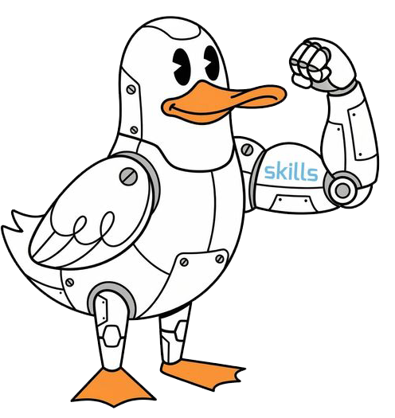

<h1> MotherDuck Skills Plugin</h1>

MotherDuck work is not just a SQL problem. An agent needs to choose the right connection path, inspect the live workspace, write DuckDB SQL instead of PostgreSQL-shaped SQL, understand Dives and sharing, and keep production analytics patterns safe.

MotherDuck Skills packages those defaults as an installable skill catalog for compatible coding agents.

**[Install the plugin](#install-in-60-seconds)**

## One Catalog, Three Layers

### Utility Skills: The Foundation

Use these when the agent needs exact MotherDuck mechanics: connect, explore, query, use the REST API, or check DuckDB SQL behavior.

- `motherduck-connect`
- `motherduck-explore`
- `motherduck-query`
- `motherduck-duckdb-sql`
- `motherduck-rest-api`

### Workflow Skills: The Playbooks

Use these when the work has multiple steps and MotherDuck-specific tradeoffs.

- `motherduck-load-data`
- `motherduck-model-data`
- `motherduck-share-data`
- `motherduck-create-dive`
- `motherduck-ducklake`
- `motherduck-security-governance`
- `motherduck-pricing-roi`

### Use-Case Skills: The End-to-End Paths

Use these when the agent is designing or shipping a product surface, rollout, migration, or partner implementation.

- `motherduck-build-cfa-app`
- `motherduck-build-dashboard`
- `motherduck-build-data-pipeline`
- `motherduck-migrate-to-motherduck`
- `motherduck-enable-self-serve-analytics`
- `motherduck-partner-delivery`

## Why This Plugin Is Different

This is not a loose prompt pack. It is a maintained MotherDuck guidance layer:

- **18 curated skills** with dependency rules across utility, workflow, and use-case layers.
- **Live-data first guidance** when MotherDuck MCP or another live connection is available.
- **DuckDB-first SQL defaults** so agents avoid PostgreSQL-only syntax in MotherDuck work.
- **Runnable examples and references** for dashboards, customer-facing analytics, pipelines, migrations, and rollout plans.
- **Multi-host packaging** for Claude Code, GitHub Copilot CLI, Codex, Cursor, Gemini CLI, and plain `SKILL.md` installs.

## What You Get

| Component | What it adds | Examples |
| --- | --- | --- |
| **MotherDuck skills** | Product defaults, routing, guardrails, and implementation guidance | Connect, explore, query, REST API, Dives, DuckLake, sharing |
| **Reference playbooks** | Deeper scenario guidance preserved outside the short skill bodies | Migration validation, dashboard patterns, CFA architecture |
| **Artifacts** | Small runnable examples for validated workflows | Python and TypeScript examples for dashboards, pipelines, migrations |
| **Packaged host surfaces** | Native manifests where the host supports plugin or extension discovery | Claude, Codex, Cursor, Gemini |

The source skills live in `skills/`. Packaged host manifests live in `.claude-plugin/`, `.codex-plugin/`, `.cursor-plugin/`, `.agents/plugins/`, `plugins/`, and `gemini-extension.json`.

## Install in 60 Seconds

### Prerequisites

Before you install, make sure you have:

- Git available on your PATH.
- Node.js 18+ if you use the Skills CLI or host plugin tooling.
- The Skills CLI when using the shared install path:

```bash
npm install -g @fountainai/skills
```

For live MotherDuck work, authenticate through your normal path: `MOTHERDUCK_TOKEN`, the Postgres endpoint credentials, a native `md:` DuckDB connection, or MotherDuck MCP. Do not paste tokens into prompts or skill files.

### Install Matrix

Use this table when you want the fastest copy-paste install route for a specific harness.

| Harness | Install |
| --- | --- |
| `GitHub Copilot CLI` | `/plugin marketplace add motherduckdb/agent-skills` then `/plugin install motherduck-skills@motherduck-skills` |
| `Claude Code` | `/plugin marketplace add motherduckdb/agent-skills` then `/plugin install motherduck-skills@motherduck-skills` |
| `Codex` | `codex plugin marketplace add motherduckdb/agent-skills`, then install **MotherDuck Skills** from `/plugins` |
| `Cursor` | `npx -y skills add motherduckdb/agent-skills --agent cursor --skill '*' --yes --global` |
| `Gemini CLI` | `gemini extensions install https://github.com/motherduckdb/agent-skills --consent` |

For the shared Skills CLI route:

```bash
npx -y skills add motherduckdb/agent-skills --skill '*' --yes
```

Global install:

```bash
npx -y skills add motherduckdb/agent-skills --skill '*' --yes --global
```

Install for every supported agent directory:

```bash
npx -y skills add motherduckdb/agent-skills --all
```

### Skills CLI

This is the most portable path for Cursor, VS Code/GitHub Copilot, Codex, Claude Code, custom agents, and project-level installs.

Install the full catalog into the current project:

```bash
npx -y skills add motherduckdb/agent-skills --skill '*' --yes
```

Install globally:

```bash
npx -y skills add motherduckdb/agent-skills --skill '*' --yes --global
```

Install for every supported agent directory:

```bash
npx -y skills add motherduckdb/agent-skills --all
```

Check what got installed:

```bash
npx -y skills ls -g
npx -y skills ls -g -a cursor
npx -y skills ls -g -a github-copilot
```

### GitHub Copilot CLI

Use the plugin path when you want the full MotherDuck bundle available inside Copilot CLI.

Inside a Copilot CLI session, add the marketplace the first time:

```text
/plugin marketplace add motherduckdb/agent-skills
```

Install the plugin:

```text
/plugin install motherduck-skills@motherduck-skills
```

Update later:

```text
/plugin update motherduck-skills@motherduck-skills
```

This repository exposes the Copilot-compatible marketplace through `.claude-plugin/marketplace.json`; Copilot CLI also looks in `.claude-plugin/` for plugin marketplaces.

For VS Code agent mode or Copilot cloud agent skills, use a skills install rather than the Copilot CLI plugin install:

```bash
npx -y skills add motherduckdb/agent-skills --agent github-copilot --skill '*' --yes --global
```

GitHub CLI also has a native `gh skill` flow. It is useful when you want to inspect and install one skill at a time:

```bash
gh skill preview motherduckdb/agent-skills motherduck-connect
gh skill install motherduckdb/agent-skills motherduck-connect --agent github-copilot --scope user
```

To browse the catalog interactively:

```bash
gh skill install motherduckdb/agent-skills
```

GitHub's `gh skill` support is in public preview, so prefer the Skills CLI for a repeatable "install everything" command.

Copilot skill locations to know:

| Scope | Common locations |
| --- | --- |
| Project skills | `.github/skills`, `.claude/skills`, `.agents/skills` |
| Personal skills | `~/.copilot/skills`, `~/.agents/skills` |

### Claude Code

Add the marketplace the first time:

```text
/plugin marketplace add motherduckdb/agent-skills
```

Install the plugin:

```text
/plugin install motherduck-skills@motherduck-skills
```

Update later:

```text
/plugin update motherduck-skills@motherduck-skills
```

For local plugin development and validation:

```bash
claude --plugin-dir ./plugins/motherduck-skills-claude
```

### Codex

Add the marketplace:

```bash
codex plugin marketplace add motherduckdb/agent-skills
```

Then open `/plugins` in Codex and install **MotherDuck Skills** from the repo marketplace.

Enable or disable individual skills from `/skills` after the plugin is installed.

### Cursor

Cursor supports plugins that can bundle skills, and this repo ships Cursor manifests at `.cursor-plugin/plugin.json` and `.cursor-plugin/marketplace.json`.

Until MotherDuck Skills has a published Cursor Marketplace listing, use the Skills CLI for local installs:

```bash
npx -y skills add motherduckdb/agent-skills --agent cursor --skill '*' --yes --global
```

For project-scoped installs, run the same command without `--global` from the repository where you want Cursor to use the skills:

```bash
npx -y skills add motherduckdb/agent-skills --agent cursor --skill '*' --yes
```

Check the install:

```bash
npx -y skills ls -g -a cursor
```

Restart Cursor or reload the window so it re-indexes installed skills. Then prompt with:

> Use MotherDuck Skills to inspect my schema and recommend a dashboard starting point.

For plugin development or marketplace submission, keep `.cursor-plugin/plugin.json`, `.cursor-plugin/marketplace.json`, `skills/`, and `assets/duck_skills.png` together at the plugin root.

### Gemini CLI

Install the extension from GitHub:

```bash
gemini extensions install https://github.com/motherduckdb/agent-skills --consent
```

For local development from a checkout:

```bash
gemini extensions link .
```

### Manual Per-Skill Install

Copy the full skill directory, not only `SKILL.md`, so referenced `references/`, `scripts/`, and `artifacts/` stay available.

```bash
mkdir -p ~/.agents/skills
cp -R skills/motherduck-connect ~/.agents/skills/motherduck-connect
```

## Verify the Installation

After install, try three checks.

### 1. Verify Skill Routing

Ask:

> Use MotherDuck Skills to choose the best connection path for this project.

You should get MotherDuck-specific connection guidance, including the Postgres endpoint and native DuckDB tradeoffs.

### 2. Verify SQL Defaults

Ask:

> Write a MotherDuck query that joins two analytics tables and explain any DuckDB syntax assumptions.

You should see DuckDB SQL guidance, not PostgreSQL-only syntax.

### 3. Verify Live Discovery

If MotherDuck MCP or another live connection is available, ask:

> Explore my MotherDuck workspace and summarize the databases, schemas, and likely dashboard starting points.

The agent should inspect real metadata before inventing examples.

## Prompts to Try

- `Use MotherDuck Skills to connect this app to MotherDuck.`
- `Explore my MotherDuck workspace and identify the best table for a dashboard.`
- `Write a DuckDB SQL query for this KPI and validate the syntax.`
- `Design a Dive-backed dashboard from these tables.`
- `Plan a Snowflake-to-MotherDuck migration with validation and rollback steps.`
- `Design a customer-facing analytics architecture on MotherDuck.`
- `Decide whether this workload needs DuckLake or native MotherDuck storage.`
- `Use the MotherDuck REST API guidance to manage service accounts and tokens safely.`

## Start Here by Task

For narrow technical work, start with `motherduck-connect`, then `motherduck-explore`, then `motherduck-query`. For end-to-end product work, start with the matching use-case skill and let it orchestrate the lower layers.

| If you need to... | Start with... |
| --- | --- |
| Connect an app or service to MotherDuck | `motherduck-connect` |
| Inspect a live workspace or schema | `motherduck-explore` |
| Write or debug analytics SQL | `motherduck-query` |
| Check exact DuckDB syntax | `motherduck-duckdb-sql` |
| Use the REST API for service accounts, tokens, Duckling config, active accounts, or Dive embed sessions | `motherduck-rest-api` |
| Load files, cloud objects, HTTPS data, dataframes, or upstream systems | `motherduck-load-data` |
| Model schemas, tables, views, or transformation layers | `motherduck-model-data` |
| Publish, consume, or govern shares | `motherduck-share-data` |
| Build, theme, preview, save, update, or embed a Dive | `motherduck-create-dive` |
| Evaluate DuckLake | `motherduck-ducklake` |
| Plan security, access, governance, or residency | `motherduck-security-governance` |
| Frame workload cost drivers or ROI | `motherduck-pricing-roi` |
| Build customer-facing analytics | `motherduck-build-cfa-app` |
| Build a dashboard | `motherduck-build-dashboard` |
| Design a data pipeline | `motherduck-build-data-pipeline` |
| Plan a migration | `motherduck-migrate-to-motherduck` |
| Roll out self-serve analytics | `motherduck-enable-self-serve-analytics` |
| Deliver repeatable partner implementations | `motherduck-partner-delivery` |

## Skills Overview

| Skill | Layer | Use it when |
| --- | --- | --- |
| `motherduck-connect` | Utility | you need to choose the right connection path before writing code or SQL |
| `motherduck-explore` | Utility | you need to inspect real databases, schemas, tables, columns, views, or shares |
| `motherduck-query` | Utility | you need to write, validate, or optimize DuckDB SQL against MotherDuck |
| `motherduck-duckdb-sql` | Utility | you need DuckDB SQL syntax or MotherDuck-specific SQL constraints quickly |
| `motherduck-rest-api` | Utility | you need the REST API for service accounts, tokens, Duckling config, active accounts, or Dive embed sessions |
| `motherduck-load-data` | Workflow | you need to ingest files, cloud objects, HTTP data, dataframes, or upstream systems into MotherDuck |
| `motherduck-model-data` | Workflow | you need to design analytical schemas, tables, views, or transformation layers |
| `motherduck-share-data` | Workflow | you need to publish, consume, or govern MotherDuck shares safely |
| `motherduck-create-dive` | Workflow | you need to build, theme, preview, save, update, or embed a Dive |
| `motherduck-ducklake` | Workflow | you need to decide whether DuckLake is appropriate and how to apply it safely |
| `motherduck-security-governance` | Workflow | you need MotherDuck-specific guidance on security, access, governance, or residency |
| `motherduck-pricing-roi` | Workflow | you need to frame workload cost drivers, pricing posture, or ROI tradeoffs |
| `motherduck-build-cfa-app` | Use-case | you are building a customer-facing analytics product on MotherDuck |
| `motherduck-build-dashboard` | Use-case | you are building one coherent analytics dashboard backed by Dives and tables |
| `motherduck-build-data-pipeline` | Use-case | you are designing an ingestion-to-serving data pipeline on MotherDuck |
| `motherduck-migrate-to-motherduck` | Use-case | you are moving from Snowflake, Redshift, Postgres, or dbt-heavy stacks onto MotherDuck |
| `motherduck-enable-self-serve-analytics` | Use-case | you are rolling out internal self-serve analytics, sharing, and governed dashboards |
| `motherduck-partner-delivery` | Use-case | you are delivering repeatable multi-client MotherDuck implementations for customers or partners |

## Repository Layout

| Path | Purpose |
| --- | --- |
| `skills/*/SKILL.md` | Source skill content and frontmatter |
| `skills/*/references/` | Longer playbooks and implementation guidance |
| `skills/*/artifacts/` | Small runnable examples |
| `skills/catalog.json` | Machine-readable skill index and source-doc map |
| `.claude-plugin/marketplace.json` | Claude Code and Copilot-compatible marketplace manifest |
| `.codex-plugin/plugin.json` | Codex plugin manifest |
| `.cursor-plugin/plugin.json` | Cursor plugin manifest |
| `.cursor-plugin/marketplace.json` | Cursor marketplace manifest |
| `gemini-extension.json` | Gemini CLI extension manifest |
| `plugins/` | Packaged plugin copies for supported hosts |

## Troubleshooting

### The agent is not using MotherDuck skills

- Confirm the skill or plugin installed in the host you are using.
- Restart or reload the host so it re-indexes skills.
- Mention MotherDuck explicitly in the prompt once: `Use MotherDuck Skills...`.

### Live workspace exploration does not work

- Confirm your MotherDuck MCP server or database connection is configured.
- Check that `MOTHERDUCK_TOKEN` or your Postgres endpoint credentials are available to the agent process.
- Ask the agent to list its available MCP tools before starting live discovery.

### The agent writes PostgreSQL-specific SQL

- Ask it to use `motherduck-duckdb-sql`.
- Prefer fully qualified names like `"database"."schema"."table"`.
- Keep PostgreSQL-driver guidance limited to connection interoperability; query syntax should stay DuckDB SQL.

## Maintainer Checks

Run these after changing skills, catalogs, manifests, or README examples:

```bash
uv run scripts/validate_skills.py
claude plugin validate ./.claude-plugin/marketplace.json
claude plugin validate ./plugins/motherduck-skills-claude
uv run scripts/check_claude_plugin_sync.py
uv run scripts/check_codex_plugin_sync.py
uv run --with duckdb --with pyyaml python tests/validate_snippets.py
```

## Links

- [MotherDuck Documentation](https://motherduck.com/docs/)
- [MotherDuck MCP Server](https://motherduck.com/docs/key-tasks/ai-and-motherduck/mcp-setup/)
- [MotherDuck Dive Gallery](https://motherduck.com/dive-gallery/)
- [DuckDB Documentation](https://duckdb.org/docs/)
- [DuckLake](https://ducklake.select/)
- [Agent Skills Specification](https://agentskills.io)
- [GitHub Copilot Agent Skills](https://docs.github.com/en/copilot/how-tos/copilot-on-github/customize-copilot/customize-cloud-agent/add-skills)
- [Cursor Plugin Specification](https://github.com/cursor/plugins)

## License

This project is licensed under the [MIT License](LICENSE).
