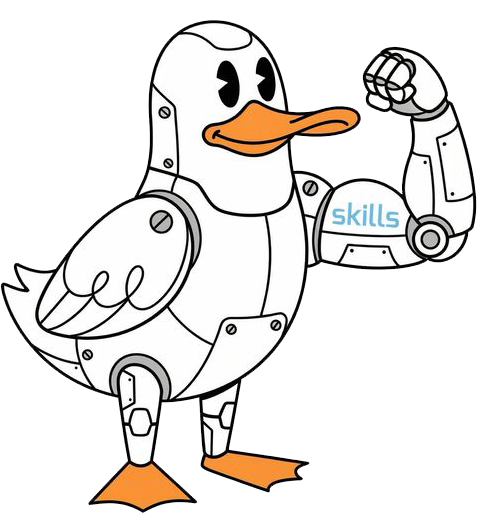

<h1> MotherDuck Skills</h1>

[](https://github.com/motherduckdb/agent-skills/releases/latest)
[](LICENSE)

22 skills for coding agents working with [MotherDuck](https://motherduck.com): connect applications, query real data with DuckDB SQL, build Dives and Flights, and deliver analytics pipelines and apps.

Each skill includes focused instructions and, where useful, detailed references and runnable examples. Installing the skills does not configure a MotherDuck connection or MCP server.

## Install

Choose one route for your agent. Run commands beginning with `/` inside the agent; run the others in your terminal.

| Agent | Install |
| --- | --- |
| Claude Code / GitHub Copilot CLI | `/plugin marketplace add motherduckdb/agent-skills`, then `/plugin install motherduck-skills@motherduck-skills` |
| Codex | `codex plugin marketplace add motherduckdb/agent-skills`, then open `/plugins` and install **MotherDuck Skills** |
| Gemini CLI | `gemini extensions install https://github.com/motherduckdb/agent-skills` |
| Cursor / VS Code / other supported agents | Use the Skills CLI below |

The [Skills CLI](https://github.com/vercel-labs/skills) needs Git and Node.js 22.20+ ([package requirements](https://github.com/vercel-labs/skills/blob/main/package.json)). No global CLI installation is needed:

```bash
npx -y skills add motherduckdb/agent-skills
```

Select the skills and agents interactively. To install the whole catalog for Cursor:

```bash
npx -y skills add motherduckdb/agent-skills --agent cursor --skill '*' --yes --global
```

Use `--agent github-copilot` for VS Code/GitHub Copilot, or another supported agent name. Omit `--global` for a project-scoped install.

See the [install matrix](docs/install-matrix.md) for alternatives, updates, verification, and manual installation. [Harness support](HARNESSES.md) documents the discovery paths and plugin manifests.

## Use the Skills

Ask for the task directly, or name a skill from the catalog:

> Use motherduck-connect to choose the connection path for this app.

> Explore my MotherDuck workspace and build a sales dashboard as a Dive.

> Plan a migration to MotherDuck with validation and rollback steps.

For live work, configure [MotherDuck MCP](https://motherduck.com/docs/key-tasks/ai-and-motherduck/mcp-setup/) or an authenticated database client. Supply credentials through your normal secret or environment setup, never in prompts or committed files.

Start with the skill that matches the task. Reuse established connection and schema context; load supporting references only when needed. The skills favor DuckDB SQL, live schema discovery, native MotherDuck storage by default, and backend credentials for customer-facing apps.

## Skills Overview

**Utility** skills handle individual operations; **workflow** skills cover specific MotherDuck capabilities; **use-case** skills combine them for end-to-end work.

| Skill | Layer | Use it for |
| --- | --- | --- |
| `motherduck-connect` | Utility | Connections, authentication, client selection, and read scaling |
| `motherduck-cli` | Utility | Terminal queries and file-based Dive/Flight workflows |
| `motherduck-explore` | Utility | Databases, schemas, shares, and sample data |
| `motherduck-query` | Utility | Writing, executing, and optimizing analytical SQL |
| `motherduck-duckdb-sql` | Utility | DuckDB syntax and MotherDuck feature support |
| `motherduck-rest-api` | Utility | Service accounts, tokens, Ducklings, and embed sessions |
| `motherduck-load-data` | Workflow | Bulk ingestion from files, storage, or external systems |
| `motherduck-model-data` | Workflow | Analytical schemas and transformation models |
| `motherduck-manage-guides` | Workflow | Business definitions and reusable warehouse context |
| `motherduck-share-data` | Workflow | Share audiences, grants, table filters, and refresh policy |
| `motherduck-create-dive` | Workflow | Creating, editing, publishing, sharing, or embedding Dives |
| `motherduck-create-flight` | Workflow | Running and scheduling Python jobs on MotherDuck |
| `motherduck-design-dive` | Workflow | Dive layout, responsive behavior, themes, and accessibility |
| `motherduck-ducklake` | Workflow | DuckLake storage choices and operations |
| `motherduck-security-governance` | Workflow | Permissions, isolation, residency, and compliance |
| `motherduck-pricing-roi` | Workflow | Costs, plan fit, and ROI |
| `motherduck-build-cfa-app` | Use-case | Customer-facing analytics with tenant isolation |
| `motherduck-build-dashboard` | Use-case | A dashboard's analytical story, metrics, and section queries |
| `motherduck-build-data-pipeline` | Use-case | Ingestion-to-serving pipelines |
| `motherduck-migrate-to-motherduck` | Use-case | Migration, reconciliation, cutover, and rollback |
| `motherduck-enable-self-serve-analytics` | Use-case | Governed analytics for internal teams |
| `motherduck-partner-delivery` | Use-case | Repeatable delivery across client engagements |

Browse the [source skills](skills/) or the [machine-readable catalog](skills/catalog.json).

## Troubleshooting

- **Skill not discovered:** check that it is installed for the agent you are using, reload the agent, and name the skill explicitly.
- **Live queries fail:** verify the MCP server or database connection and its credentials. Skills provide guidance, not account access.
- **PostgreSQL-only syntax:** use `motherduck-duckdb-sql`. PostgreSQL wire compatibility does not change the SQL dialect.

## Contributing

Edit source skills under `skills/`; the `plugins/` directories contain generated packages. See [CONTRIBUTING.md](CONTRIBUTING.md) for checks and package synchronization, [skill authoring](docs/skill-authoring.md) for conventions, and [ARCHITECTURE.md](ARCHITECTURE.md) for catalog rules.

Releases use the [release process](docs/release-process.md) and `scripts/bump_version.py`; do not edit version numbers by hand.

## Resources

- [MotherDuck documentation](https://motherduck.com/docs/)
- [DuckDB documentation](https://duckdb.org/docs/)
- [Agent Skills specification](https://agentskills.io)

## License

[MIT](LICENSE).
